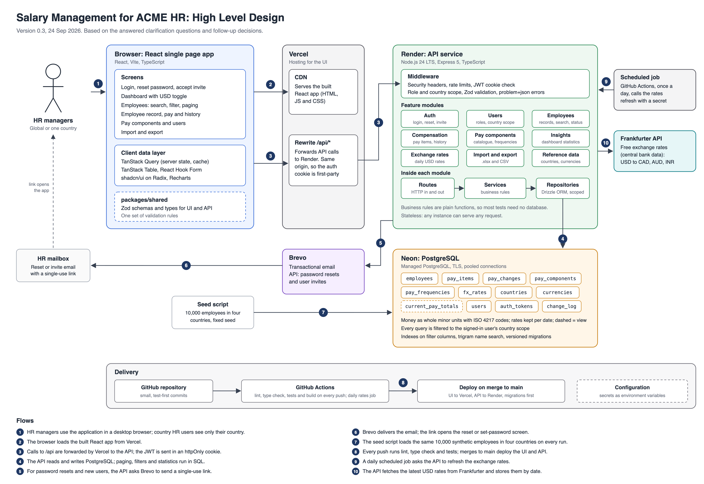

# Salary Management for ACME HR

[](https://github.com/vin2k20/salary-management/actions/workflows/ci.yml)

A web application where global and country HR managers maintain pay data for 10,000 employees in India, the USA, Canada and Australia, and see how the organisation pays people on a dashboard.

Status: walking skeleton deployed, features not started.

Live app: https://acme-salary-management-vineet.vercel.app (the first request after a quiet period can take about a minute while the free API service wakes up). This README is an outline and is filled in as each step of the [implementation plan](docs/implementation-plan.md) is merged.

## Overview

- Two roles: global HR managers see all countries; country HR managers see only their own country.
- Employee directory with search, filters, sorting and paging.
- Employee records with country-specific fields, a change log, and inactive status instead of deletion.
- Pay as a set of components with frequencies, shown as monthly equivalent and annual total, with a dated history of pay changes.
- Daily USD exchange rates and a toggle between USD and local currency.
- Dashboard: pay range per country, average pay per job title, cost per department, monthly and annual cost, and peer outliers.
- Import and export in Excel and CSV.

Full scope: [requirements](docs/requirements.md).

## Architecture



- **Web app** (`apps/web`): a React single page app built with Vite. It calls the API under `/api` on its own origin: through the Vite proxy in development and a Vercel rewrite in production, so the auth cookie stays first-party and no CORS setup is needed.
- **API** (`apps/api`): a stateless Express 5 service. Node.js 24 runs its TypeScript source directly, with no build step. Every request gets an ID, returned in the `X-Request-Id` header and written on every log line. Errors use the problem details format (RFC 9457) and include the request ID.
- **Shared package** (`packages/shared`): Zod schemas and types used by both the API and the web app.
- **Database** (from step 05): PostgreSQL on Neon, in the same AWS region as the API.

Full details are in the [high level design](docs/high-level-design.md).

## Tech stack

- TypeScript in strict mode, in one repository with npm workspaces:
  - `apps/api`: Express 5 API with Helmet, pino logging and Zod
  - `apps/web`: React app built with Vite, with TanStack Query for server data
  - `packages/shared`: Zod schemas, types and rules shared by the API and the web app
- Node.js 24, ESLint and Prettier, Vitest with Supertest and React Testing Library.

Choices and reasons are in the [decisions log](docs/decisions-and-questions.md).

## Getting started

Prerequisites: Node.js 24 (see `.nvmrc`; with nvm, run `nvm use`) and npm 11.

```bash
npm install
cp apps/api/.env.example apps/api/.env   # then set DATABASE_URL, JWT_SECRET and SEED_HR_PASSWORD
npm run db:migrate -w @salary/api
npm run db:seed -w @salary/api
npm run check
npm run dev
```

`npm run dev` starts the API on http://localhost:3000 and the web app on http://localhost:5173. Open the web app and sign in as one of the demo HR users (below) with the password you set in `SEED_HR_PASSWORD`. Stop both with Ctrl+C.

`npm run check` runs lint, the format check, the type check and all tests. Other root scripts:

| Script | What it does |
|---|---|
| `npm run lint` | ESLint with type-aware rules |
| `npm run format` | Format files with Prettier |
| `npm run format:check` | Check formatting without changing files |
| `npm run typecheck` | Type check every workspace |
| `npm test` | Run the tests in every workspace |
| `npm run build` | Build the web app for production (the API runs from source) |
| `npm run dev` | Start the API and the web app in watch mode |

### Environment variables

The API reads its settings from environment variables and stops at start-up if a value is invalid. For local development, copy `apps/api/.env.example` to `apps/api/.env` and change values as needed. `.env` files are never committed.

| Variable | Default | Purpose |
|---|---|---|
| `DATABASE_URL` | none, required | PostgreSQL connection string. Locally, the pooled string of your Neon development branch (or a local PostgreSQL database), ending in `sslmode=verify-full` for Neon |
| `JWT_SECRET` | none, required | Signs session tokens; at least 32 characters. Generate one with `node -e "console.log(require('crypto').randomBytes(48).toString('base64url'))"` and use a different value in each environment |
| `SEED_HR_PASSWORD` | none, needed by `db:seed` | Password for the demo HR users; at least 12 characters |
| `NODE_ENV` | `development` | `production` makes the session cookie Secure (HTTPS only) and requires Brevo for email |
| `APP_URL` | `http://localhost:5173` | Web app address, used in links in emails |
| `EMAIL_TRANSPORT` | `console` | `console` writes emails, including reset links, to the API log; `brevo` sends them |
| `BREVO_API_KEY` | none, needed for `brevo` | Brevo API key (starts with `xkeysib-`) |
| `EMAIL_FROM` | none, needed for `brevo` | Sender address verified in Brevo |
| `RATES_REFRESH_SECRET` | none | Shared with the daily GitHub Actions refresh; at least 32 characters. Without it the scheduled refresh endpoint is off, and global HR users can still refresh by hand |
| `TRUST_PROXY` | `false` | `true` behind Vercel and Render, so the login rate limit sees the client IP address |
| `PORT` | `3000` | Port the API listens on |
| `LOG_LEVEL` | `info` | pino log level: `fatal`, `error`, `warn`, `info`, `debug`, `trace` or `silent` |

If the API runs on another port, start the web app with `API_PROXY_TARGET` set, for example `API_PROXY_TARGET=http://localhost:4000`.

## Database and seed data

PostgreSQL, accessed with Drizzle ORM. The schema is defined in `apps/api/src/db/schema.ts`, and every change is a versioned SQL migration in `apps/api/drizzle/`.

| Script | What it does |
|---|---|
| `npm run db:migrate -w @salary/api` | Apply pending migrations to the database in `DATABASE_URL`. Safe to run again. |
| `npm run db:generate -w @salary/api` | Write a new migration after changing the schema. Review the SQL before committing it. |

The migrations also load the reference data: the four countries and their currencies, the eight pay frequencies and the system pay components per country. Pay totals come from the `current_pay_totals` view, built on the `pay_totals_on(date)` function, which adds up the pay items that apply on a date as annual amounts in local currency.

### Seed data

`npm run db:seed -w @salary/api` loads a synthetic data set for the dashboard, filters and peer comparison. It is generated with Faker from a fixed seed and a fixed reference date, so every run loads exactly the same data:

- 10,000 employees: 6,000 in India, 1,500 in the USA, 1,500 in Canada and 1,000 in Australia, with names in each country's style, regions, ten departments and six levels.
- About 80% full-time, 8% part-time, 8% contractors and 4% interns, and about 5% inactive.
- Pay components and approximate 2026 rates per country from the research notes, with employer contributions as amounts; contractors get a contract fee and interns a stipend. A few employees are paid well above or below their peers.
- One to three pay changes per employee: the hire, then up to two yearly revisions or promotions (April in India, January elsewhere). About 18,000 pay changes and 114,000 pay items.
- Starting exchange rates to US dollars, marked with the source `seed`.

Emails use the reserved `example.com` domain, and no real personal data or pay is used.

Every run also creates or updates the demo HR users, all with the password in `SEED_HR_PASSWORD`. Running the seed again changes the password and signs out existing sessions.

| Email | Role | Sees |
|---|---|---|
| `global.hr@acme.example.com` | Global HR | All countries, and manages users |
| `hr.in@acme.example.com` | Country HR | India |
| `hr.us@acme.example.com` | Country HR | USA |
| `hr.ca@acme.example.com` | Country HR | Canada |
| `hr.au@acme.example.com` | Country HR | Australia |

| Option | What it does |
|---|---|
| `-- --reset` | Replace existing employees, pay and seed exchange rates. Reference data is kept. Without it, the script stops if employees exist. |
| `-- --count 2000` | Load fewer employees, keeping the same country split. |
| `-- --seed 42` | Generate a different data set. |
| `-- --users-only` | Create or update only the demo HR users. |

The load runs in one transaction, so a failed run changes nothing. Against the Neon development branch it takes about 45 seconds.

## User management

Global HR users manage HR users on the Users page:

- **Add a user** with a name, email, role and, for country HR users, their country. The user gets an invite email with a link to choose a password (valid 72 hours). If the email cannot be sent, the user is still saved and the page says so.
- **Edit** a user's name, role or country. A country HR user always has one country; a global HR user has none.
- **Resend invite** to a user who has not set a password yet.
- **Deactivate** a user, which signs them out at once and stops them signing in, or reactivate them. Users are never deleted.
- Nobody can deactivate themselves or change their own role, so the organisation cannot lose its last global HR user by mistake.

Every change is written to the change log with who made it (`GET /api/users/:id/change-log`). Country HR users cannot see or use these endpoints (403).

## Employee directory

The Employees page lists the employees in the user's scope with their annual total and monthly equivalent:

- **Search** by part of a name or the start of an employee code, and **filter** by country (global HR only), region, department, job title and employment type. Inactive employees are hidden unless included.
- **Sort** by name, job title, department, location or annual total. Annual totals are compared in US dollars, so the order makes sense across countries, whichever currency is shown.
- **Page** through 25, 50 or 100 rows at a time.
- Every filter, the sort and the page are kept in the URL, so a view can be bookmarked or shared.
- Amounts follow the currency toggle; in US dollars the rate date is shown.

The API does the searching, filtering, sorting and paging (`GET /api/employees`), always within the user's country scope; a country HR user who asks for another country gets an empty list. `GET /api/reference` gives the filter choices in scope.

## Exchange rates and currency

- **Rates:** US dollar reference rates for CAD, AUD and INR come from the [Frankfurter API](https://frankfurter.dev) (central bank rates, no key). One row per currency and date is kept, so history is never overwritten; repeated refreshes for a date change nothing.
- **Daily refresh:** the GitHub Actions workflow `Refresh exchange rates` (`.github/workflows/refresh-rates.yml`) runs every day at 06:30 UTC and can be run by hand from the Actions tab. It calls `POST /api/internal/fx-rates/refresh` on Render with `Authorization: Bearer <RATES_REFRESH_SECRET>`, retrying for about two minutes while the free API wakes up. The same secret is a repository secret in GitHub and an environment variable in Render.
- **By hand:** global HR users can press **Refresh rates** on the dashboard.
- **Currency toggle:** the header switches every amount between local currency and US dollars. The choice is kept in the URL (`?currency=USD`), so a shared link shows the same view, and in the browser for next time. Converted amounts show the date of the rates used, and the dashboard warns when rates are more than three days old.

## Password reset and invites

- **Forgot password:** the sign-in page links to a form that emails a reset link. The API answers the same way whether or not the email has an account, and sends at most three links per email in 15 minutes.
- **Links:** each link carries a random single-use token; only its SHA-256 hash is stored. Reset links last 30 minutes and invite links 72 hours, and a new link replaces an older unused one. Setting a password ends every older session for that user and is recorded in the change log.
- **Email:** Brevo sends the emails in production. Locally, `EMAIL_TRANSPORT=console` writes them to the API log, so you can open a link without an email account.

## Tests

Each workspace uses Vitest, with test files next to the code they test (`*.test.ts`). Run all tests with `npm test`, or one workspace with `npm test -w @salary/api`. API and database tests run against PGlite, PostgreSQL in memory: each test file gets a fresh database with every migration applied, so tests need no running database or network. UI tests use React Testing Library, and a Playwright smoke test comes later.

GitHub Actions runs lint, the format check, the type check, all tests and the build on every push and on every pull request to `main` (`.github/workflows/ci.yml`).

## Deployment

Every service runs on its free plan.

| Part | Service | Address | Configuration |
|---|---|---|---|
| Web app | Vercel (Hobby) | https://acme-salary-management-vineet.vercel.app | `vercel.json` |
| API | Render free web service, Ohio | https://acme-salary-api-oxu3.onrender.com | `render.yaml` |
| Database (from step 05) | Neon free plan, AWS us-east-2 (Ohio) | Connection string in Render settings only | |

How it fits together:

- The browser only talks to the Vercel domain. Vercel serves the web app and rewrites `/api/*` to the Render API, so the auth cookie stays first-party and no CORS setup is needed.
- A merge to `main` deploys both parts. Vercel builds the web app. Render deploys the API only after the CI workflow has passed on the commit, and only when API, shared or root package files change.
- Each pull request gets a Vercel preview deployment. Previews need a Vercel login and call the production API.
- The Render build runs `npm ci --omit=dev` and then applies database migrations, so they run before the new version starts. A failed migration fails the deploy and the running version stays up.
- The Render service runs `node apps/api/src/server.ts`, with a health check on `/api/health`, which also checks the database. Render sets `PORT`; `NODE_ENV`, `LOG_LEVEL`, `TRUST_PROXY`, `APP_URL` and `EMAIL_TRANSPORT` come from `render.yaml`. `DATABASE_URL` (the pooled string of the Neon production branch), `JWT_SECRET`, `BREVO_API_KEY`, `EMAIL_FROM`, `RATES_REFRESH_SECRET` and later secrets are set in the Render dashboard and never committed.
- The free Render service sleeps after 15 minutes without traffic and takes about a minute to wake. Open the app a few minutes before a demo.

## Demo

To be completed in steps 21 and 22.

- Production URL
- Demo logins for both roles
- Demo video

## Documents

| Document | What it covers |
|---|---|
| [Requirements](docs/requirements.md) | One-page scope, quality bar and what was left out |
| [Clarification questions](docs/clarification-questions.md) | Questions for ACME and the decided answers |
| [Decisions and questions](docs/decisions-and-questions.md) | Technology and design decisions with reasons and alternatives |
| [High level design](docs/high-level-design.md) | Architecture, data model, API, flows, security, testing and deployment |
| [Design approach and trade-offs](docs/design-approach-and-trade-offs.md) | The reasoning behind the design and the options considered |
| [Implementation plan](docs/implementation-plan.md) | Step by step build plan and progress tracker |
| [Research: payroll in India](docs/research-india-payroll.md) | How salary and payroll are managed in India |
| [Research: pay structures by country](docs/research-country-pay-structures.md) | Employee fields and pay components for the four countries |
| [Project history](docs/ai/log.md) | One line per completed step |

## Working with AI

This project is built with Claude Code as a pair programmer. The rules it follows are in [CLAUDE.md](CLAUDE.md).
