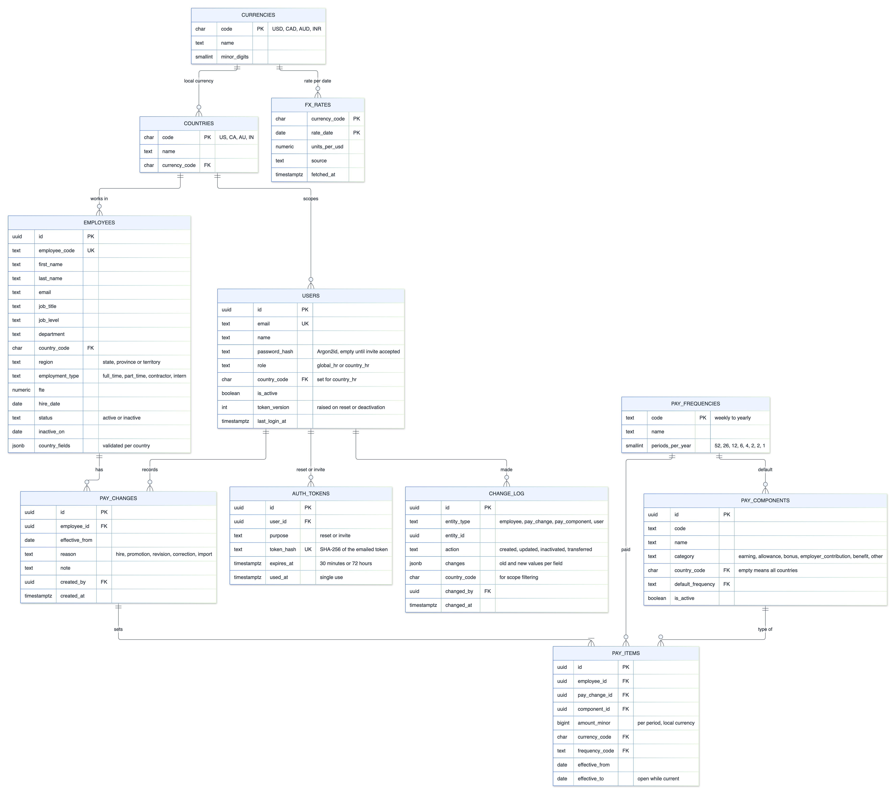
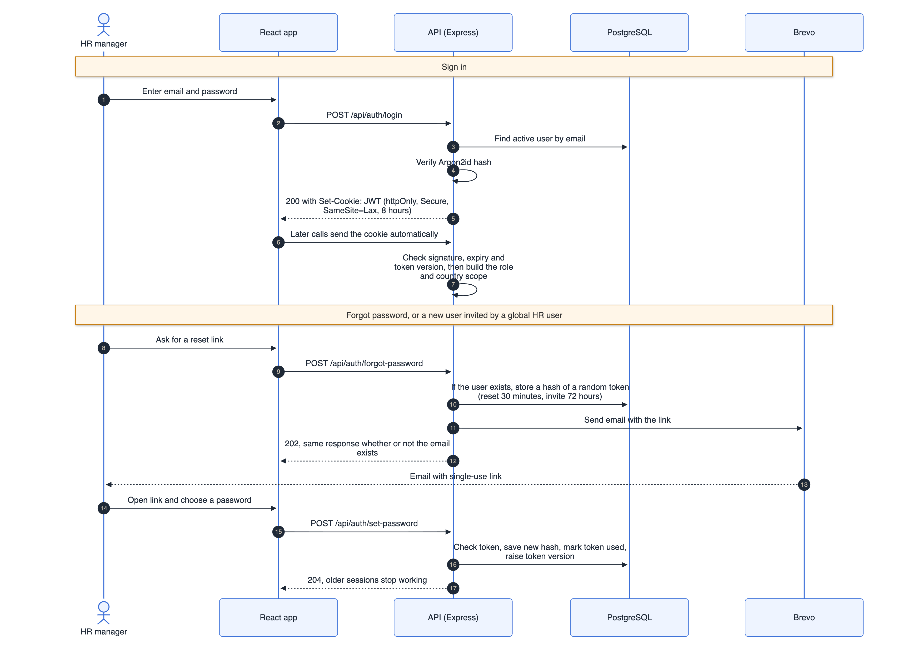
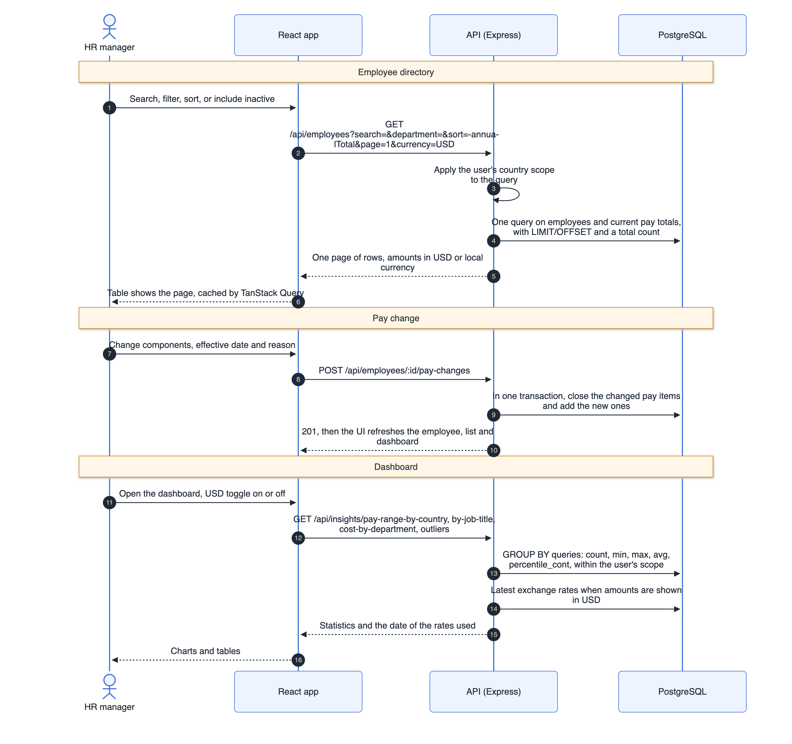
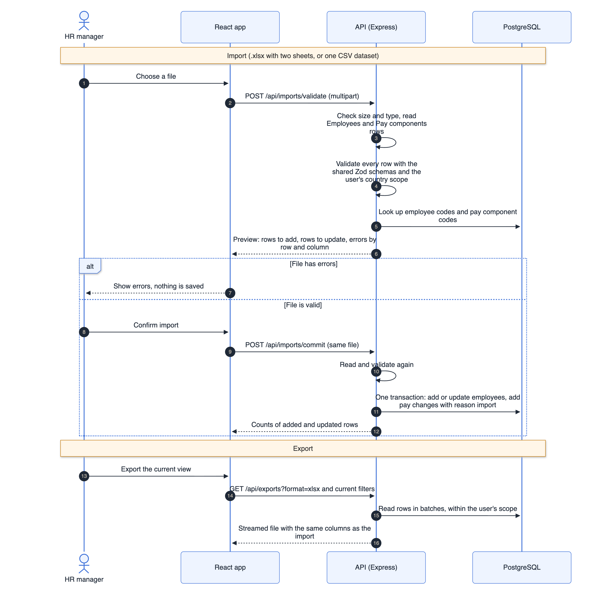
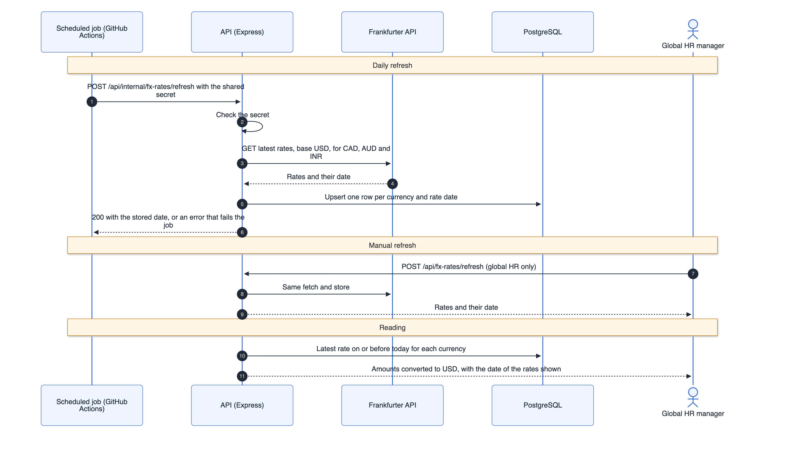

# Salary Management for ACME HR: High Level Design

Author: Vineet Kumar | Date: 24 Sep 2026 | Version: 0.3 (based on requirements v1.1, the answered clarification questions and the follow-up decisions)

## 1. Purpose and scope

This document describes how the salary management application will be built: the main parts, how they talk to each other, the data model, the API, access rules, security, testing and deployment. It covers every feature in the requirements: login with reset and invites, two HR roles with country scope, employees, pay components with frequencies and history, daily exchange rates with a USD toggle, the dashboard, import and export, and seed data for 10,000 employees in four countries.

Design goals:

- Answer pay questions for 10,000 employees quickly, with paging, filtering and statistics done in the database.
- Keep business rules in one place and easy to test without a database.
- Keep pay data private: every API call needs a valid login, the auth token is never readable from page scripts, and country scope is enforced on the server.
- Keep the application a data and insight tool that can grow: new features go into new modules, and pay rules that change yearly are stored as data, not code.

## 2. Architecture overview


The application has three runtime parts and three external services:

- **Web app:** a React single page app, served as static files from Vercel's CDN.
- **API:** a stateless Node.js service on Render, built with Express 5 and TypeScript.
- **Database:** PostgreSQL on Neon.
- **Email:** Brevo's transactional email API, for password reset and invite links.
- **Exchange rates:** the Frankfurter API, called once a day to store USD rates for CAD, AUD and INR.
- **Scheduled job:** a GitHub Actions workflow that calls the API's rate refresh endpoint once a day.

The browser calls the API under `/api` on the same domain as the UI. Vercel forwards these calls to Render. This keeps the auth cookie first-party and removes the need for CORS.

## 3. Components

### 3.1 Web app

| Screen | Purpose | Who |
|---|---|---|
| Login, forgot password, set password | Sign in, request a reset link, set a password from a reset or invite link | Everyone |
| Dashboard | Pay range per country, average pay per job title, cost per department, monthly and annual cost, peer outliers | Both roles, within scope |
| Employee directory | Search, filter, sort and page through employees, with an option to include inactive ones | Both roles, within scope |
| Employee record | Employee details, current pay components with monthly and annual totals, pay history, change log, record a pay change, mark inactive, move to another country (global HR) | Both roles, within scope |
| New employee | Add an employee with starting pay components | Both roles, within scope |
| Pay components | View the component catalogue and add or deactivate components | Global HR for all countries, country HR for their country |
| Users | Add users, set role and country, resend invites, deactivate | Global HR only |
| Import and export | Upload .xlsx or CSV with a preview and row errors; download the current view | Both roles, within scope |

Across the app:

- A **currency toggle** switches amounts between USD and local currency. On any view of one country (the dashboard for a country, a directory filtered to one country, an employee record) it switches between USD and that country's currency. On the all-countries dashboard, org-wide totals are always in USD and the per-country figures follow the toggle. The choice is kept in the URL and in the browser, and every screen that shows converted amounts also shows the date of the rates used.
- **TanStack Query** holds server data and refreshes it after changes. **TanStack Table** renders lists with server-side paging, sorting and filtering. **React Hook Form** with the shared Zod schemas validates forms. **shadcn/ui** (on Radix) provides accessible components, and **Recharts** draws the charts.
- The URL holds list filters, so a filtered view can be bookmarked and shared.
- The UI hides actions a user cannot take, but the API enforces every rule on its own.

### 3.2 API

Each feature module has the same three layers:

- **Routes:** read the HTTP request, validate it with Zod, call a service, and write the response.
- **Services:** business rules, such as annual totals from frequencies, pay change rules, peer comparison and import checks. Written as plain functions where possible, so they can be tested without a database.
- **Repositories:** all SQL, through Drizzle ORM. Every repository function takes the caller's scope, so country filtering cannot be forgotten.

| Module | Responsibility |
|---|---|
| Auth | Login, logout, current user, forgot password, set password from reset or invite links, JWT issue and check |
| Users | List, add, update and deactivate users; send and resend invites (global HR only) |
| Employees | Create, read, update, search and filter employees; mark inactive; move to another country; change log |
| Compensation | Current pay items and totals, pay history, pay changes |
| Pay components | Component catalogue per country and the list of frequencies |
| Insights | Dashboard statistics in USD or local currency |
| Exchange rates | Fetch rates from Frankfurter, store them per date, return the latest |
| Import and export | Read and validate .xlsx and CSV files, commit valid files, stream exports |
| Reference data | Countries, currencies, regions and filter options within scope |
| Change log (shared) | One helper that every service calls, in the same transaction, to record what changed, old and new values, who and when |

Middleware, in order: security headers (Helmet), request logging (pino, with a request ID), JSON body limit, rate limiting on auth routes, JWT cookie check and scope building on all routes except health, auth and the internal rates endpoint, and a final error handler that returns `application/problem+json`.

### 3.3 Access rules

| Action | Global HR | Country HR |
|---|---|---|
| View and edit employees and pay | All countries | Own country only |
| Dashboard and statistics | All countries, org-wide totals in USD | Own country only |
| Import and export | All countries | Own country only; rows for other countries are errors |
| Add or deactivate pay components | Any country or all countries | Own country only |
| Manage users | Yes | No |
| Refresh exchange rates by hand | Yes | No |
| Move an employee to another country | Yes | No |
| See the change log | All records | Records in own country; not users |

The auth middleware turns the signed-in user into a scope: all countries, or one country. Services and repositories apply it to every read and write. A request for a record outside the scope returns 404, so the response does not reveal that the record exists.

### 3.4 Shared package

`packages/shared` holds the Zod schemas and TypeScript types for requests and responses, the per-country schemas for country-specific employee fields, the list of roles, and shared rules such as the peer comparison limits. The UI and the API import the same schemas, and the import feature uses them to check each row of an uploaded file.

### 3.5 Repository layout

```
salary-management/
  apps/
    api/          Express API: modules, middleware, db schema, migrations, seed
    web/          React app: routes, screens, components, API client
  packages/
    shared/       Zod schemas, shared types and shared rules
  docs/           requirements, decisions, design, diagrams, project history
  .github/        CI workflow and the daily exchange rates workflow
```

## 4. Data model



Key points:

- **Pay is a set of components.** `pay_components` is the catalogue (for example basic, HRA, superannuation, 401(k) match), each with a category, a default frequency, and a country or all countries. HR can add new components.
- **Pay items and pay changes.** Each `pay_items` row holds one component for one employee: amount per period, currency, frequency, and the dates it applies from and to. A `pay_changes` row groups the items changed together with a date and reason, so one annual revision can change several components at once, and history is never overwritten.
- **Frequencies are data.** `pay_frequencies` stores periods per year: weekly 52, bi-weekly 26, monthly 12, bi-monthly 6, quarterly 4, bi-quarterly 2, half-yearly 2, yearly 1. Annual amount = amount x periods per year; monthly equivalent = annual amount / 12.
- **Current pay** comes from items whose date range covers today. The `current_pay_totals` view gives each employee's annual total, annual gross pay (earnings, allowances and bonuses) and monthly equivalent in local currency. The directory and the dashboard read from it. If it ever becomes slow, the totals can be stored on the employee row and updated in the same transaction as each pay change.
- **Money** is stored as `bigint` whole minor units with an ISO 4217 currency code. Pay items use the employee's local currency. Derived values, such as monthly equivalents and USD amounts, are calculated as exact decimals and rounded only for display.
- **Exchange rates** are stored per currency and date as units per USD, so earlier figures can be reproduced. Conversion uses the latest rate on or before the date shown.
- **Employees** have common fields, a region (state, province or territory), employment type and FTE, and a `country_fields` JSON column for the few country-specific fields, validated by a Zod schema per country. No government IDs, bank details, date of birth or gender are stored.
- **Inactive employees** keep their data, with a status and an inactive date, and are left out of lists and statistics unless included.
- **Users** have a role and, for country HR, a country. Reset and invite links share the `auth_tokens` table with a purpose field.
- **Change log.** `change_log` records every change to employees, pay, pay components and users: entity, action, old and new values as JSON, the user and the time, and the country for scope filtering. Entries are written in the same transaction as the change and never edited.
- **Monthly cost** is the monthly equivalent of current pay. Actual monthly payments are not recorded, as that would be payroll (Q10).
- **Indexes:** unique `employee_code`; indexes on `country_code`, `department`, `job_title`, `employment_type` and `status`; a trigram index on names for partial search; and `(employee_id, effective_from)` on pay items.

Sizes: about 10,000 employees, around 50,000 current pay items and around 100,000 pay items with history. This is small for PostgreSQL.

## 5. API design

Conventions:

- JSON over HTTPS under `/api`, with plural resource names.
- Lists use `page` and `pageSize` (maximum 100) and return `{ items, page, pageSize, total }`.
- Sorting uses `sort=field` or `sort=-field` for descending order.
- Amounts are returned as `{ amountMinor, currency }`. Endpoints that show amounts take `currency=local` or `currency=USD`, and responses that use exchange rates include the rate date.
- Errors use the problem details format (RFC 9457), with a field-level error list for validation errors.

| Method and path | Purpose | Access |
|---|---|---|
| `POST /api/auth/login` | Sign in and set the session cookie | Public |
| `POST /api/auth/logout` | Clear the session cookie | Signed in |
| `GET /api/auth/me` | Current user, role and scope | Signed in |
| `POST /api/auth/forgot-password` | Send a reset link if the email exists (always 202) | Public |
| `POST /api/auth/set-password` | Set a password from a reset or invite token | Public, with token |
| `GET /api/users` | List users | Global HR |
| `POST /api/users` | Add a user and send an invite | Global HR |
| `PATCH /api/users/:id` | Change role, country or active status | Global HR |
| `POST /api/users/:id/invite` | Resend the invite | Global HR |
| `GET /api/users/:id/change-log` | Change log for a user | Global HR |
| `GET /api/employees` | List with search, filters, include inactive, sort, paging and currency | Scoped |
| `POST /api/employees` | Create an employee with starting pay items | Scoped |
| `GET /api/employees/:id` | Employee details with current pay totals | Scoped |
| `PATCH /api/employees/:id` | Update details or mark inactive | Scoped |
| `POST /api/employees/:id/transfer` | Move to another country with new pay in the new currency | Global HR |
| `GET /api/employees/:id/change-log` | Change log for an employee and their pay | Scoped |
| `GET /api/employees/:id/pay` | Current pay items with monthly and annual totals | Scoped |
| `GET /api/employees/:id/pay-changes` | Pay history | Scoped |
| `POST /api/employees/:id/pay-changes` | Record a pay change for one or more components | Scoped |
| `GET /api/pay-components` | Component catalogue and frequencies | Scoped |
| `POST /api/pay-components` | Add a component | Scoped |
| `PATCH /api/pay-components/:id` | Rename or deactivate a component | Scoped |
| `GET /api/insights/summary` | Headcount, monthly and annual cost; org-wide totals in USD | Scoped |
| `GET /api/insights/pay-range-by-country` | Minimum, quartiles, median, maximum and average per country | Scoped |
| `GET /api/insights/by-job-title?country=` | Headcount, average, median and range per job title | Scoped |
| `GET /api/insights/cost-by-department?country=` | Monthly and annual cost per department | Scoped |
| `GET /api/insights/outliers?country=` | Employees more than 20% above or below the peer median | Scoped |
| `GET /api/fx-rates/latest` | Latest rates and their date | Signed in |
| `POST /api/fx-rates/refresh` | Refresh rates now | Global HR |
| `POST /api/internal/fx-rates/refresh` | Refresh rates from the scheduled job | Shared secret |
| `GET /api/reference` | Countries, currencies, regions and filter options | Scoped |
| `POST /api/imports/validate` | Check an uploaded file and return a preview with row errors | Scoped |
| `POST /api/imports/commit` | Save a valid file in one transaction | Scoped |
| `GET /api/imports/template?format=&dataset=` | Download an empty template | Signed in |
| `GET /api/exports?format=&dataset=` | Download the filtered data as .xlsx or CSV | Scoped |
| `GET /api/health` | Health check for the hosting platform | Public |

Insight endpoints also take `measure=total` (default) or `measure=gross`, and `includeInactive`.

## 6. Key flows

### 6.1 Sign in, password reset and invites



### 6.2 Employee directory, pay change and dashboard



Pay change rules:

- A pay change has an effective date and a reason, and sets new values for one or more components, or ends a component.
- In one transaction, the open item for each changed component gets an end date, and a new item starts on the effective date.
- Future-dated changes are allowed and do not affect current pay until their date.
- Moving an employee to another country (global HR only) changes the country, region and country fields, ends all current pay items and starts new pay in the new country's currency with the reason "transfer", all in one transaction.
- Every pay change and employee change is written to the change log in the same transaction.

### 6.3 Import and export



Import and export design:

- **File format.** An Excel file has two sheets: Employees (one row per employee) and Pay components (one row per employee and component: employee code, component code, amount, frequency, effective date). A CSV file holds one of the two, chosen when importing or exporting.
- **Two calls instead of saved uploads.** The file is sent once to validate and again to commit, and the commit checks it again, so the API stores nothing between the two steps.
- **All or nothing.** A file is saved in one transaction only when every row is valid.
- **Matching.** Employees are matched by employee code and components by component code. Pay rows create a pay change with the reason "import".
- **Scope and limits.** Country HR users can only import and export their own country. Files have a maximum size and row count, and type and extension checks.

### 6.4 Exchange rates



- A GitHub Actions workflow runs once a day and calls `POST /api/internal/fx-rates/refresh` with a shared secret. The call also wakes the API if it is asleep.
- The API asks Frankfurter for the latest rates with USD as the base, and stores one row per currency and rate date. Central banks publish on working days, so weekend runs store nothing new.
- Global HR users can also refresh by hand. Seed data includes starting rates, so the app works before the first refresh.
- Screens show the date of the rates used. If the latest rates are more than three days old, the dashboard shows a notice.

## 7. Security

| Area | Approach |
|---|---|
| Passwords | Hashed with Argon2id. Never logged or returned. |
| Session | Signed JWT (HS256, using `jose`) in an httpOnly, Secure, SameSite=Lax cookie, valid for 8 hours. The token carries the user ID and a token version. |
| Role and country scope | Built from the user record on each request and applied in services and repositories. Out-of-scope records return 404. Tests cover both roles for every endpoint. |
| Logout, reset and deactivation | Logout clears the cookie. A password reset or deactivation raises the user's token version, which makes older tokens invalid. |
| Reset and invite tokens | 32 random bytes, stored only as a SHA-256 hash, single use. Reset links last 30 minutes, invite links 72 hours. The forgot password response is the same whether or not the email exists. |
| Internal endpoint | The scheduled rates refresh needs a long random secret in a header, compared in constant time. The secret is kept in GitHub and Render settings. |
| Cross-site requests | Same-origin API, SameSite=Lax cookies, and JSON-only request bodies for changes. |
| Brute force | Rate limits on login and forgot password, per IP address and per email. |
| Input | Zod validation on every request. Parameterised SQL through Drizzle. Upload size and type limits. |
| Spreadsheet export | Cells that start with `=`, `+`, `-` or `@` are escaped, so exported files cannot run formulas when opened in Excel. |
| Headers | Helmet defaults, including a content security policy for the UI on Vercel. |
| Secrets | JWT secret, database URL, Brevo API key and the rates secret are kept in platform environment variables, never in the repository. |
| Change log | Every change to employees, pay, pay components and users is recorded with who and when, in the same transaction. Entries are never edited, and reading them follows the same country scope. |
| Personal data | No government IDs, bank details, date of birth or gender. Logs never include pay amounts or passwords. The demo uses synthetic data only. |

## 8. Performance and scale

- Around 100,000 pay rows fit easily in PostgreSQL memory. The main risk is sending too much data to the browser, so lists are always paged (50 rows by default).
- Filters and sorts use indexed columns. Name search uses a trigram index.
- Statistics are single `GROUP BY` queries over the current pay totals view, using `min`, `max`, `avg` and `percentile_cont` for medians and quartiles. Peer medians use one grouped query, not one query per employee.
- USD conversion joins the latest rate per currency, a handful of rows.
- Export reads rows in batches and streams the file, so memory stays flat.
- No server-side cache. TanStack Query caches pages and dashboard results in the browser and refreshes them after changes.
- Target: list and dashboard responses under 500 ms with the seeded data. If the totals view is too slow, the fallback is stored totals on the employee row.
- Known limit: Render's free tier sleeps when idle, so the first request after a pause can take about a minute.

## 9. Testing strategy

| Level | Tools | What is covered |
|---|---|---|
| Unit | Vitest | Annual and monthly amounts per frequency, pay change rules, peer comparison, currency conversion and formatting, import row checks, export escaping, scope rules |
| API | Vitest, Supertest, PGlite | Each endpoint against a real PostgreSQL engine in memory: validation, auth, both roles and out-of-scope access, paging, statistics queries, import transaction, rates refresh with a fake Frankfurter response |
| UI components | Vitest, React Testing Library | Forms, table interactions, currency toggle, role-based visibility, error and empty states |
| End to end | Playwright | One smoke test: sign in, search for an employee, record a pay change, see the dashboard update, switch currency |

Tests are written before the code where practical, use fixed test data, and do not depend on time or network: the clock and the Frankfurter client are passed in, so tests can control them.

## 10. Deployment and environments

| Environment | Web | API | Database | Email | Exchange rates |
|---|---|---|---|---|---|
| Local | Vite dev server, with a proxy for `/api` | `node --watch` | Local PostgreSQL or a Neon development branch | Links logged to the console, or a Brevo test key | Seeded rates; manual refresh |
| CI | Build only | Tests with PGlite | PGlite in memory | Fake sender | Fake client |
| Production | Vercel | Render | Neon | Brevo | Daily GitHub Actions job and Frankfurter |

The API and the database run in the same region: Render in Ohio and Neon in AWS us-east-2 (D40).

Release steps: every push runs lint, type check, tests and build in GitHub Actions. A merge to main deploys the UI to Vercel and the API to Render. Database migrations run before the new API version starts. The seed script is run manually against a new database. All services run on free plans.

## 11. Operations

- `GET /api/health` checks the API and the database connection.
- Structured JSON logs with a request ID on every line, so one request can be traced from start to end.
- Errors return a problem details body with the request ID, and the full error is logged on the server only.
- The daily rates job fails visibly in GitHub Actions if the refresh fails, and the dashboard shows a notice when rates are more than three days old.

## 12. How the answers shaped this design

The clarification questions were shared with the Incubyte team, who replied that everything in the brief is important and left the details to me. I answered the questions myself and then confirmed a few follow-up decisions; the full answers are in `clarification-questions.md`.

| Question | Answer in short | Design impact |
|---|---|---|
| Q1 Users and roles | Global and country HR managers | Roles, country scope in every query, user management with invites |
| Q2 Login | JWT with forgot and reset password | Auth module, auth tokens, Brevo |
| Q3 Salary definition | Several components with frequencies, monthly and annual views, new components can be added | Pay components, pay items, pay changes, frequencies table, totals view |
| Q4 Fields | Researched per country for four countries | Common employee fields, region, country fields in JSON; research notes |
| Q5 Currency | Local currencies, org-wide in USD, daily rates, toggle | Exchange rates module, daily job, currency parameter on endpoints |
| Q6 History | Keep pay history | Pay changes and dated pay items |
| Q7 Employee types | All four types; India 60%, USA 15%, Canada 15%, Australia 10% | Employment type and FTE, seed distribution |
| Q8 Leavers | Inactive, hidden unless included | Status and inactive date, include inactive option |
| Q9 Pay questions | All of them on a dashboard | Insights endpoints and dashboard, peer comparison |
| Q10 Payroll | Not needed; data and insights, ready to grow | No payroll module; separate modules make additions easy |
| Q11 Import and export | Wanted | Import and export module with two datasets |
| Follow-up decisions | Change log, moves between countries, monthly cost from current pay, currency toggle on country views | Change log table and helper, transfer endpoint, monthly totals, currency rules |

## 13. Trade-offs and future work

- **Offset paging** is simple and fine for 10,000 rows. Keyset paging would be the next step for much larger data.
- **Application-level scope** is simple and testable. PostgreSQL row-level security could be added as a second layer later.
- **A totals view instead of stored totals** avoids duplicated data. Stored totals are the fallback if measurements show a need.
- **Stored employer contributions** instead of calculated ones keep the tool free of yearly rule changes. A rules module could calculate them later.
- **Daily rates** match the answer to Q5. More frequent updates would need a paid rate source and add little for pay reporting.
- **Synchronous import** is fine for files of about 10,000 employees. Much larger files would move to a background job.
- **Pay bands, compa-ratio and review cycles** would build on the same components, job titles and peer groups.
